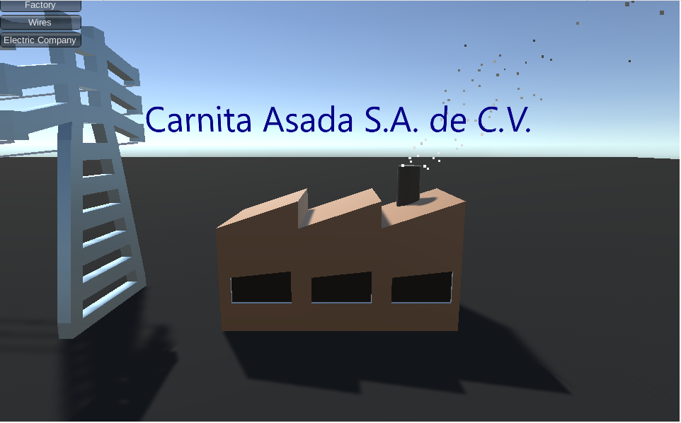

# Carnita Asada
This is an extra project I am making for Circuits II which will demonstrate the loss of power caused by transporting electricity via wires over long distances and the use of a transformer in order to convert voltages.

[Link to the demonstration.](https://jamesscn.github.io/CarnitaAsada/)

